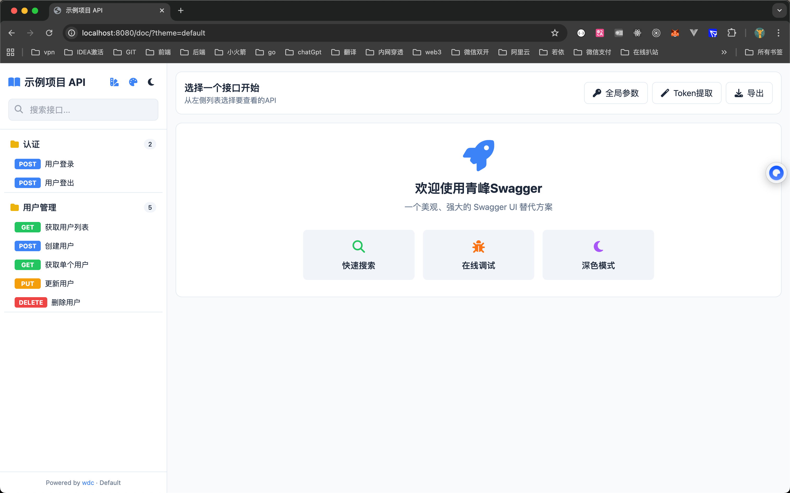
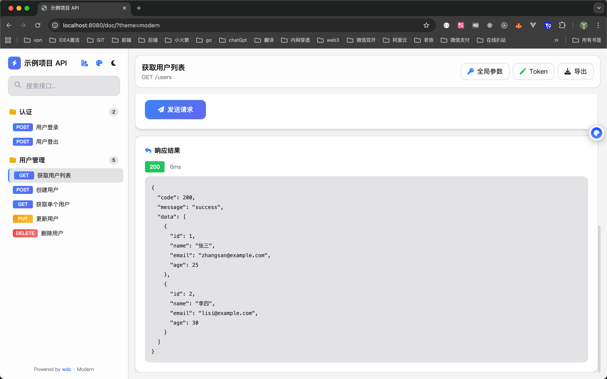
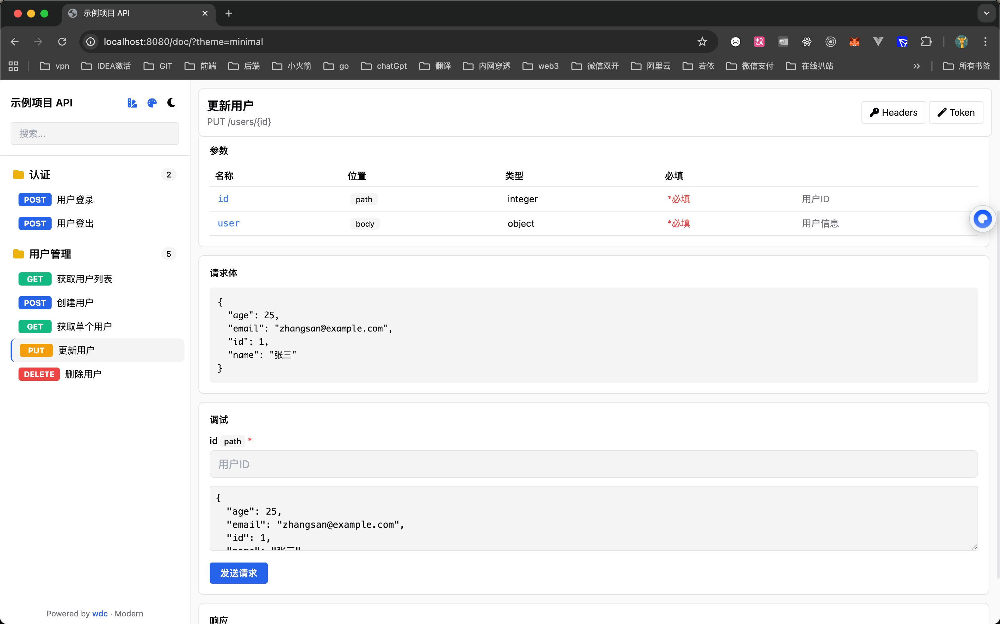
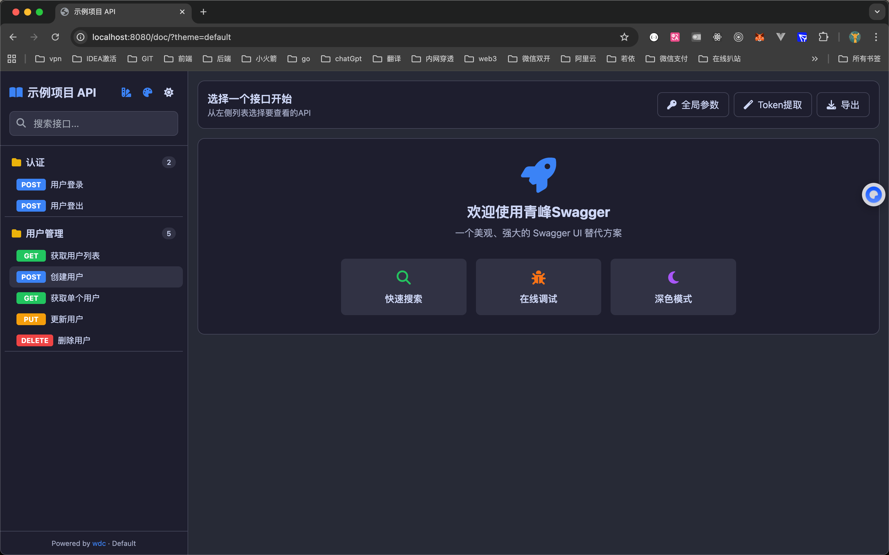
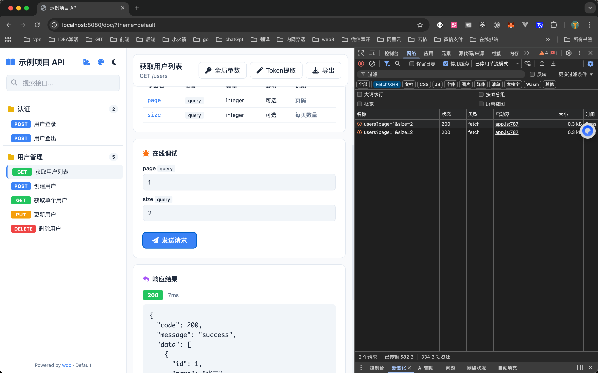

# 青峰Swag by wdc

[English](./README_EN.md) | 中文

⚡️ 一个美观、强大的 Swagger UI 替代方案，专为 Go Gin 框架设计。

> 为 Go 开发者提供更好的 API 文档体验。

[](https://github.com/wdcbot/qingfeng)
[](https://gitee.com/xiaowan1997/qingfeng)

## 📸 预览

### Default 主题


### Modern 主题


### Minimal 主题


### 深色模式


### 在线调试


### 移动端
| 浅色模式 | 深色模式 |
|:--------:|:--------:|
|  |  |

## ✨ 特性

- 🎨 **多主题支持** - 提供 Default、Minimal、Modern 三种 UI 风格
- 🌓 **深色/浅色模式** - 支持主题切换，保护眼睛
- 🎯 **多种主题色** - 蓝、绿、紫、橙、红、青六种主题色可选
- 🔍 **快速搜索** - 实时搜索接口，快速定位（支持 Ctrl+K 快捷键）
- 🐛 **在线调试** - 内置 API 调试工具，类似 Postman
- 🔑 **全局请求头** - 支持配置全局 Headers（如 Authorization）
- 🪄 **Token 自动提取** - 从响应中自动提取 Token 设置到全局参数
- 🔄 **自动生成文档** - 启动时自动运行 swag init
- 📦 **零依赖前端** - 使用 embed.FS 内嵌，无需额外部署
- 🚀 **简单集成** - 一行代码接入现有项目
- 📱 **移动端适配** - 完美支持手机访问，侧边栏抽屉式交互
- 💾 **设置持久化** - 主题、UI 风格、全局参数自动保存到本地
- ✨ **JSON 语法高亮** - 响应结果彩色高亮显示

## 🔄 无侵入替换

如果你的项目已经在使用其他 Swagger UI 组件（如 gin-swagger、swaggo 等），可以无侵入替换为青峰Swag：

**只需两步：**

1. 安装青峰Swag：
```bash
go get github.com/wdcbot/qingfeng
# 国内镜像: go get gitee.com/xiaowan1997/qingfeng
```

2. 替换路由注册（保留原有的 swag 注释和 docs 目录）：

```go
// 替换前 (gin-swagger)
import swaggerFiles "github.com/swaggo/files"
import ginSwagger "github.com/swaggo/gin-swagger"
r.GET("/swagger/*any", ginSwagger.WrapHandler(swaggerFiles.Handler))

// 替换后 (青峰Swag)
import qingfeng "github.com/wdcbot/qingfeng"
r.GET("/doc/*any", qingfeng.Handler(qingfeng.Config{
    Title:   "我的 API",
    BasePath: "/doc",
    DocPath:  "./docs/swagger.json",
}))
```

**无需修改：**
- ✅ 原有的 swag 注释（@Summary、@Router 等）
- ✅ 已生成的 docs 目录（swagger.json、swagger.yaml）
- ✅ 业务代码

青峰Swag 直接读取 `swagger.json` 文件，与 swag 工具完全兼容。

---

## 📦 从零开始

### 1. 创建项目

```bash
mkdir myapi && cd myapi
go mod init myapi
```

### 2. 安装依赖

```bash
go get github.com/gin-gonic/gin
go get github.com/wdcbot/qingfeng@latest
# 国内镜像: go get gitee.com/xiaowan1997/qingfeng@latest
go install github.com/swaggo/swag/cmd/swag@latest
```

### 3. 创建 main.go

```go
package main

import (
    "github.com/gin-gonic/gin"
    qingfeng "github.com/wdcbot/qingfeng"
)

// @title 我的 API
// @version 1.0
// @description 这是我的第一个 API
// @host localhost:8080
// @BasePath /api

func main() {
    r := gin.Default()

    // 注册文档 UI
    r.GET("/doc/*any", qingfeng.Handler(qingfeng.Config{
        Title:    "青峰API--wdc",
        BasePath: "/doc",
        DocPath:  "./docs/swagger.json",
        AutoGenerate: true, // 启动时自动运行 swag init 生成文档 默认false

    }))

    // API 路由
    r.GET("/api/hello", hello)

    r.Run(":8080")
}

// @Summary 打招呼
// @Tags 示例
// @Success 200 {string} string "Hello World"
// @Router /hello [get]
func hello(c *gin.Context) {
    c.JSON(200, gin.H{"message": "Hello World"})
}
```

### 3.1 完整的配置说明（只是说明可 步骤3即可正常运行）
```go
r.GET("/doc/*any", qingfeng.Handler(qingfeng.Config{
    // 文档标题
    Title: "我的 API",
    // 文档描述
    Description: "API 文档描述",
    // API 版本号
    Version: "1.0.0",
    // 文档路由前缀
    BasePath: "/doc",
    // swagger.json 文件路径
    DocPath: "./docs/swagger.json",
    // 直接传入 swagger JSON 内容（与 DocPath 二选一）
    // DocJSON: []byte{},
    // 是否启用在线调试
    EnableDebug: true,
    // 是否默认深色模式
    DarkMode: false,
    // UI 主题风格: ThemeDefault(默认) / ThemeMinimal(简约) / ThemeModern(现代)
    UITheme: qingfeng.ThemeDefault,
    // 全局请求头配置
    GlobalHeaders: []qingfeng.Header{
        {Key: "Authorization", Value: "Bearer your-token"},
        // {Key: "X-API-Key", Value: "your-api-key"},
    },
    // 启动时自动运行 swag init 生成文档
    AutoGenerate: true,
    // swag 搜索目录（AutoGenerate 为 true 时生效）
    SwagSearchDir: ".",
    // swagger 文件输出目录（AutoGenerate 为 true 时生效）
    SwagOutputDir: "./docs",
    
    // 自定义 Logo（v1.3.0 新增）
    Logo: "https://example.com/logo.png",  // 支持 URL 或 base64
    LogoLink: "https://example.com",       // Logo 点击跳转链接
    
    // 多环境配置（v1.3.0 新增）
    Environments: []qingfeng.Environment{
        {Name: "本地开发", BaseURL: "/api/v1"},
        {Name: "测试环境", BaseURL: "https://test-api.example.com/api/v1"},
        {Name: "生产环境", BaseURL: "https://api.example.com/api/v1"},
    },
}))

```

### 4. 生成文档并运行

```bash
swag init
go run main.go
```

### 5. 访问文档

打开浏览器访问：http://localhost:8080/doc/

---

## 🚀 快速开始

```go
package main

import (
    "github.com/gin-gonic/gin"
    qingfeng "github.com/wdcbot/qingfeng"
)

func main() {
    r := gin.Default()

    // 注册青峰Swag文档 UI
    r.GET("/doc/*any", qingfeng.Handler(qingfeng.Config{
        Title:       "我的 API",
        Description: "API 文档描述",
        Version:     "1.0.0",
        BasePath:    "/doc",
        DocPath:     "./docs/swagger.json",
        EnableDebug: true,
        DarkMode:    false,
        UITheme:     qingfeng.ThemeDefault, // 可选: ThemeDefault, ThemeMinimal, ThemeModern
    }))

    r.Run(":8080")
}
```

访问 `http://localhost:8080/doc/` 查看文档。

## 🎨 UI 主题

支持三种 UI 风格，可通过 `UITheme` 配置或在界面中切换：

| 主题 | 常量 | 说明 |
|------|------|------|
| Default | `qingfeng.ThemeDefault` | 经典蓝色风格，功能完整 |
| Minimal | `qingfeng.ThemeMinimal` | 黑白极简，专业干净 |
| Modern | `qingfeng.ThemeModern` | 渐变毛玻璃，视觉冲击 |

也可以通过 URL 参数切换主题：`http://localhost:8080/doc/?theme=modern`

切换后的主题会自动保存到浏览器本地存储，下次访问自动恢复。

## 📱 移动端支持

青峰Swag 完美适配移动端：

- 📲 **抽屉式侧边栏** - 点击左上角菜单按钮打开接口列表
- 🎯 **顶部操作栏** - Headers、Token、主题等功能一键访问
- 💾 **设置同步** - 主题和参数设置在移动端和桌面端同步
- 🌓 **深色模式** - 右上角一键切换，保护眼睛


## ⚙️ 配置项

| 参数 | 类型 | 默认值 | 说明 |
|------|------|--------|------|
| Title | string | "API Documentation" | 文档标题 |
| Description | string | "" | 文档描述 |
| Version | string | "1.0.0" | API 版本 |
| BasePath | string | "/doc" | 文档路由前缀 |
| DocPath | string | "./docs/swagger.json" | swagger.json 文件路径 |
| DocJSON | []byte | nil | 直接传入 swagger JSON 内容 |
| EnableDebug | bool | true | 是否启用在线调试 |
| DarkMode | bool | false | 是否默认深色模式 |
| UITheme | UITheme | ThemeDefault | UI 主题风格 |
| GlobalHeaders | []Header | nil | 全局请求头配置 |
| AutoGenerate | bool | false | 启动时自动运行 swag init |
| SwagSearchDir | string | "." | swag 搜索目录 |
| SwagOutputDir | string | "./docs" | swagger 文件输出目录 |
| Logo | string | "" | 自定义 Logo URL 或 base64 |
| LogoLink | string | "" | Logo 点击跳转链接 |
| Environments | []Environment | nil | 多环境配置 |

## 🐳 Docker 部署（推荐）

使用 `go:embed` 将 swagger.json 嵌入二进制文件，无需单独 COPY docs 目录：

```go
package main

import (
    _"embed""embed"
    "github.com/gin-gonic/gin"
    qingfeng "github.com/wdcbot/qingfeng"
)

//go:embed docs/swagger.json
var swaggerJSON []byte

func main() {
    r := gin.Default()
    
    r.GET("/doc/*any", qingfeng.Handler(qingfeng.Config{
        Title:    "我的 API",
        BasePath: "/doc",
        DocJSON:  swaggerJSON,  // 直接嵌入，无需 DocPath
    }))
    
    r.Run(":8080")
}
```

这样 Dockerfile 只需要：
```dockerfile
FROM golang:1.20-alpine AS builder
WORKDIR /app
COPY . .
RUN go build -o main .

FROM alpine:latest
WORKDIR /app
COPY --from=builder /app/main .
# 不需要 COPY docs 目录！
EXPOSE 8080
CMD ["./main"]
```

## 🌍 多环境配置

支持配置多个环境，方便在开发、测试、生产环境间切换：

```go
r.GET("/doc/*any", qingfeng.Handler(qingfeng.Config{
    Title:    "我的 API",
    BasePath: "/doc",
    DocPath:  "./docs/swagger.json",
    Environments: []qingfeng.Environment{
        {Name: "本地开发", BaseURL: "http://localhost:8080/api/v1"},
        {Name: "测试环境", BaseURL: "https://test-api.example.com/api/v1"},
        {Name: "生产环境", BaseURL: "https://api.example.com/api/v1"},
    },
}))
```

## 🎨 自定义 Logo

支持配置自定义 Logo：

```go
r.GET("/doc/*any", qingfeng.Handler(qingfeng.Config{
    Title:    "我的 API",
    BasePath: "/doc",
    DocPath:  "./docs/swagger.json",
    Logo:     "https://example.com/logo.png", // 或 base64
    LogoLink: "https://example.com",          // 点击跳转
}))
```

## 📝 请求体模板

在调试面板中，可以将常用的请求体保存为模板：

1. 在请求体输入框上方点击「保存模板」
2. 输入模板名称
3. 下次使用时点击「模板」按钮选择已保存的模板

模板按接口保存，每个接口可以有多个模板。

## ⌨️ 快捷键

| 快捷键 | 功能 |
|--------|------|
| `Ctrl/Cmd + K` | 聚焦搜索框 |
| `Escape` | 关闭弹窗 |

## 🔑 全局请求头

可以预设全局请求头，会自动添加到所有 API 请求中：

```go
r.GET("/doc/*any", qingfeng.Handler(qingfeng.Config{
    Title:    "我的 API",
    BasePath: "/doc",
    DocPath:  "./docs/swagger.json",
    GlobalHeaders: []qingfeng.Header{
        {Key: "Authorization", Value: "Bearer your-token"},
        {Key: "X-API-Key", Value: "your-api-key"},
    },
}))
```

也可以在界面中通过「全局参数」按钮动态配置。

## 🔄 自动生成文档

启用 `AutoGenerate` 后，每次启动服务会自动运行 `swag init`：

```go
r.GET("/doc/*any", qingfeng.Handler(qingfeng.Config{
    Title:         "我的 API",
    BasePath:      "/doc",
    AutoGenerate:  true,           // 启用自动生成
    SwagSearchDir: ".",            // swag 搜索目录
    SwagOutputDir: "./docs",       // 输出目录
}))
```

需要先安装 swag：
```bash
go install github.com/swaggo/swag/cmd/swag@latest
```

## 🔧 与 swag 配合使用

1. 安装 swag:
```bash
go install github.com/swaggo/swag/cmd/swag@latest
```

2. 在代码中添加注释:
```go
// @Summary 获取用户列表
// @Description 分页获取用户
// @Tags 用户管理
// @Accept json
// @Produce json
// @Param page query int false "页码"
// @Success 200 {object} Response
// @Router /users [get]
func getUsers(c *gin.Context) {
    // ...
}
```

3. 生成文档:
```bash
swag init
```

4. 集成青峰Swag (见快速开始)

## 🤝 贡献

欢迎提交 Issue 和 Pull Request！

## 💬 交流群

扫码添加微信，备注「青峰」加入交流群：


## 📄 License

MIT License
